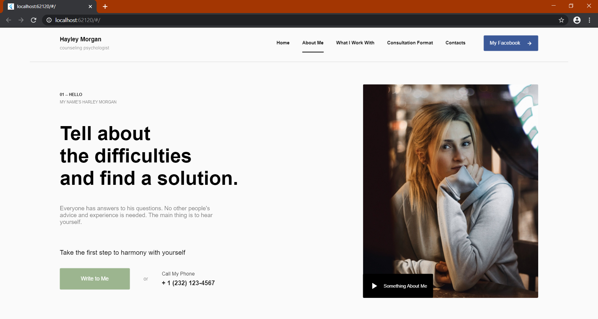

# Website Portfolio UI
This is just a UI that I took from **Dribble** and tried to implement using **flutter web**

NOTE: This is not a Responsive website

## Steps to Run🥱
1. Fork this repo
2. Clone the forked repo to your local system
3. Now you have to Switch to **flutter web** using these commands:
   1. `flutter channel beta`
   2. `flutter upgrade`
   3.  `flutter config --enable-web`
4. Now you can check all the connected devices using `flutter devices` command
5. Now run the code using `flutter run`, it will automatically ask for your choice if you have 2 or more connected devices

## The Output😉

## Design from Dribble😍

## Support😄
If you like this project, then don't forget to give it a ⭐
